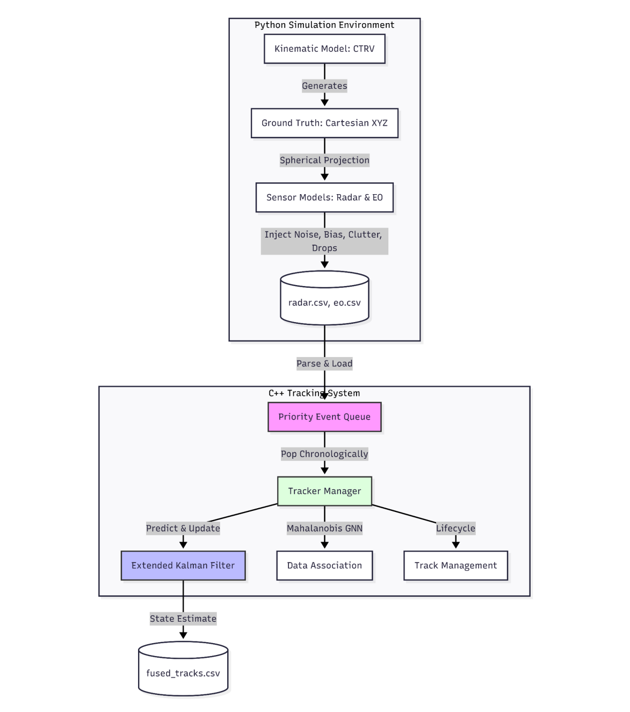

# Tracking and Sensor Fusion System 🎯


## Overview
This project implements an **Event-Driven Multi-Sensor Tracking and Fusion System**. It is designed to ingest raw, asynchronous, and noisy measurements from multiple sensors (Radar and Electro-Optics/EO) and produce a continuous, reliable 3D kinematic track of multiple targets.

The primary goal of this project is to demonstrate core concepts in **State Estimation**, **Data Association**, and **System Architecture** under realistic challenges such as sensor noise, false alarms (clutter), missed detections (drops), and asynchronous data rates. 

## 🎥 Visual Demonstration

### Tracking over Time (Simulation)

*The animation demonstrates the Extended Kalman Filter (EKF) maintaining continuous tracks despite dense clutter and sensor drops. Orange markers indicate raw measurements at time t, the gray is TENTATIVE targets while the continuous lines in color represent the fused track (CONFIRMED).*

### Raw Measurements vs. Ground Truth

*Simulation of raw sensor data (Radar and EO) including Gaussian noise, dense clutter, and missed detections alongside the ground truth.*

### Filtered Tracks vs. Ground Truth

*The final output of the Extended Kalman Filter (EKF) showing the smoothed, estimated tracks (lines) accurately following the target paths despite the target with hard maneuvers inputs (which become DEAD and return with new target ID).*

### System Architecture


*The system uses a Priority Min-Heap Queue to synchronize asynchronous sensor data based on timestamps, driving the Tracker Manager in a purely event-driven manner.*
## 🧠 Core Components & How It Works

This is a baseline, yet robust tracking system built on four main pillars:

1. **Event-Driven Synchronization (Tracker Manager):** Acts as the global clock. Measurements from different sensors are pushed into a priority queue and processed strictly chronologically. This completely solves the issue of asynchronous sensor update rates.
2. **State Estimation (Extended Kalman Filter - EKF):** Fuses non-linear observation models (Spherical Range/Azimuth/Elevation from Radar, and Az/El from EO) into a 6-DOF Cartesian state vector `(X, Y, Z, Vx, Vy, Vz)`.
> 📐 *For a deep dive into the kinematics, measurement functions, and Jacobians, please refer to the [Mathematical Foundations](docs/EKF_MATH.md) document.*
3. **Data Association (GNN):** Uses a **Greedy Nearest Neighbor** approach with statistical gating (Mahalanobis Distance). To handle clutter efficiently without exponential complexity, it enforces a rigid `Scan Mutex`—a track can only associate with one measurement per sensor, per timestamp.
4. **Lifecycle Management:** Tracks are born as `TENTATIVE` via 3D Radar hits. They upgrade to `CONFIRMED` after 5 consecutive hits (filtering out random noise). If a track receives no updates for 5 seconds, it undergoes "Coasting" (prediction only) before being declared `DEAD` (Starvation).

## 💻 Code Spotlight: Core Event Loop

The `TrackerManager` perfectly synchronizes asynchronous sensors using a Priority Min-Heap. The main event loop below highlights a clean separation of tracking phases, efficient memory management (Zero-Copy), and optimized I/O operations:

```cpp
while (!event_queue_.empty()) {
    // 1. Peek at the top measurement (Zero-Copy: We just get a raw pointer)
    const Measurement* measurement = event_queue_.top().get();
    current_time = measurement->getTimestamp();

    // 2. Predict step: Advance all existing tracks to the new event's time
    predictAll(current_time);

    // 3. Data Association step: Find the most statistically probable track
    Track* matched_track = DataAssociation::findBestMatch(active_tracks_, measurement);

    // 4. Update or Initiate step
    if (matched_track != nullptr)
    {
        matched_track->update(measurement);
    }
    else
    {
        handleUnassociatedMeasurement(measurement);
    }

    // 5. Memory Management: Pop destroys the unique_ptr and frees the measurement from RAM instantly
    event_queue_.pop();

    // 6. Track Management: Remove tracks that starved or died
    cleanupDeadTracks(current_time);

    // 7. Export results at 10Hz intervals (every 0.1 sec)
    // This prevents creating a massive CSV file with duplicated timestamps
    if (current_time - last_export_time >= 0.1)
    {
        exportTrackStates(current_time, out_file);
        last_export_time = current_time;
    }
}
```

## ⚖️ Trade-offs: Baseline vs. Real-World Production

While this system handles baseline tracking scenarios effectively, developing this into a military-grade or autonomous driving production system would require addressing several calculated trade-offs:

| Component | Current Implementation (Baseline) | Real-World / Production Alternative |
| :--- | :--- | :--- |
| **Kinematic Model** | **Constant Velocity (CV) EKF:** Uses adaptive process noise ($Q$) to handle moderate maneuvers. Fast and computationally cheap. | **Interacting Multiple Model (IMM):** Running parallel filters (e.g., CV, Constant Acceleration, Coordinated Turn) and mixing their probabilities to handle sharp, unpredictable maneuvers without track-breaks. |
| **Data Association** | **Greedy Nearest Neighbor (GNN):** Immediate, hard decisions. Very low computational cost, but prone to stealing/swapping in extremely dense target/clutter environments. | **Multiple Hypothesis Tracking (MHT) or JPDA:** Defers hard decisions by keeping a tree of hypotheses over time. Significantly more robust in dense clutter, but requires exponential computational power and pruning logic. |
| **Track Duplication** | **Survival of the Fittest:** Relies on the `Scan Mutex` to starve duplicate tracks until they die naturally. | **Explicit Track Merging:** Dedicated covariance intersection and statistical testing to actively identify and merge redundant tracks. |
| **Lifecycle** | **Rigid Thresholds:** Hard 5-second starvation rule and 5-hit confirmation. Leads to initialization delays and overshoot during target loss. | **Dynamic Thresholds:** Track scores (e.g., M/N logic) that dynamically adapt based on target range, kinematics, and real-time sensor confidence. |
| **Earth Geometry** | **Flat Earth Assumption:** Simple Cartesian-to-Spherical projections. Good for short to medium ranges. | **WGS84 / ECEF:** Accounting for Earth's curvature, crucial for long-range radar tracking (tens/hundreds of kilometers). |

## 🛠️ Tech Stack & Running the Project

- **Core Tracker:** `C++` (Object-Oriented, optimized for low latency).
- **Simulation & Analysis:** `Python` (Pandas, Matplotlib, NumPy) for generating Ground Truth, modeling sensor physics (CTRV model, spherical projections, noise injection), and analyzing RMSE.

### Quick Start
1. Clone the repository: `git clone https://github.com/netalrev/Tracking_And_Sensor_Fusion.git`
2. Generate simulated data: `python simulate_data.py`
3. Build the C++ tracker via CMake:
   ```bash
   mkdir build && cd build
   cmake ..
   make